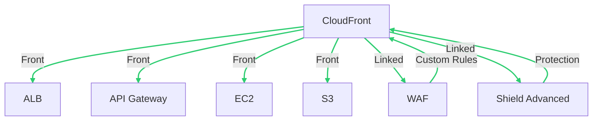

```mermaid
graph TB
  CF["CloudFront"]
  WAF["WAF"]
  SA["Shield Advanced"]
  ALB["ALB"]
  AG["API Gateway"]
  EC2["EC2"]
  S3["S3"]
  CF -- "Front" --> ALB
  CF -- "Front" --> AG
  CF -- "Front" --> EC2
  CF -- "Front" --> S3
  CF -- "Linked" --> WAF
  CF -- "Linked" --> SA
  WAF -- "Custom Rules" --> CF
  SA -- "Protection" --> CF
  linkStyle 0 stroke:#2ecd71,stroke-width:2px;
  linkStyle 1 stroke:#2ecd71,stroke-width:2px;
  linkStyle 2 stroke:#2ecd71,stroke-width:2px;
  linkStyle 3 stroke:#2ecd71,stroke-width:2px;
  linkStyle 4 stroke:#2ecd71,stroke-width:2px;
  linkStyle 5 stroke:#2ecd71,stroke-width:2px;
  linkStyle 6 stroke:#2ecd71,stroke-width:2px;
  linkStyle 7 stroke:#2ecd71,stroke-width:2px;
```